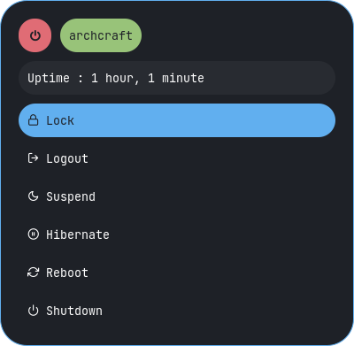
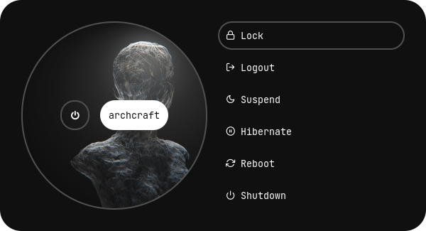

<!-- A huge collection of Rofi themes -->

<p align="center">
  
</p>

<p align="center">
  
  
  
  
</p>

<p align="center">
  <a href="https://github.com/adi1090x/rofi#launchers" target="_blank"></a>
  <a href="https://github.com/adi1090x/rofi#applets" target="_blank"></a>
  <a href="https://github.com/adi1090x/rofi#powermenus" target="_blank"></a>
</p>

<p align="center">A huge collection of <a href="https://github.com/davatorium/rofi">Rofi</a> based custom <i>Applets</i>, <i>Launchers</i> & <i>Powermenus</i>.</p>

<details>
<summary><b><code>Launchers</code></b></summary>

|Type 1|Type 2|Type 3|Type 4|
|--|--|--|--|
|||||

|Type 5|Type 6|Type 7|
|--|--|--|
||||

</details>

<details>
<summary><b><code>Applets</code></b></summary>

|Type 1|Type 2|Type 3|
|--|--|--|
||||

|Type 4|Type 5|
|--|--|
|||

</details>

<details>
<summary><b><code>Powermenus</code></b></summary>

|Type 1|Type 2|Type 3|
|--|--|--|
||||

|Type 4|Type 5|Type 6|
|--|--|--|
||||

</details>

## What is Rofi?

[Rofi](https://github.com/davatorium/rofi) is A window switcher, Application launcher and dmenu replacement. Rofi started as a clone of simpleswitcher and It has been extended with extra features, like an application launcher and ssh-launcher, and can act as a drop-in dmenu replacement, making it a very versatile tool. Rofi, like dmenu, will provide the user with a textual list of options where one or more can be selected. This can either be running an application, selecting a window, or options provided by an external script.

## Installation

> **Everything here is created on rofi version : `1.7.4`**

* First, Make sure you have the same (stable) version of rofi installed.
  - On Arch / Arch-based : **`sudo pacman -S rofi`**
  - On Debian / Ubuntu : **`sudo apt-get install rofi`**
  - On Fedora : **`sudo dnf install rofi`**

- Then, Clone this repository -
```
$ git clone --depth=1 https://github.com/adi1090x/rofi.git
```

- Change to cloned directory and make `setup.sh` executable -
```
$ cd rofi
$ chmod +x setup.sh
```

- Run `setup.sh` to install the configs -
```
$ ./setup.sh

[*] Installing fonts...
[*] Updating font cache...

[*] Creating a backup of your rofi configs...
[*] Installing rofi configs...
[*] Successfully Installed.
```

- That's it, These themes are now installed on your system.

> **Note** : These themes are like an ecosystem, everything here is connected with each other in some way. So... before modifying anything by your own, make sure you know what you doing.

---

<p align="center">
  <a href="https://github.com/sponsors/adi1090x"></a>
</p>

<p align="center">
  <b>Special thanks to all the Sponsors</b>. Maintenance of this project is made possible by you guys. If you'd like to sponsor this project and have your avatar appear below, <a href="https://github.com/sponsors/adi1090x">click here</a> 💖
</p>

<p align="center">
  <!-- sponsors --><a href="https://github.com/Cir-0"></a><a href="https://github.com/pedrosrtavares"></a><a href="https://github.com/jeandutoit"></a><a href="https://github.com/machist"></a><a href="https://github.com/neiesc"></a><a href="https://github.com/Sosiaka"></a><a href="https://github.com/alikaya"></a><a href="https://github.com/dkjxnvkdjnvkd888"></a><!-- sponsors -->
</p>

---

## Launchers

**`Change Style` :** Edit `~/.config/rofi/launchers/type-X/launcher.sh` script and edit the following line to use the style you like.
```
theme='style-1'
```

**`Change Colors` :** Edit `~/.config/rofi/launchers/type-X/shared/colors.rasi` file and edit the following line to use the color-scheme you like.
```css
@import "~/.config/rofi/colors/onedark.rasi"
```

> Colors in `type-5`, `type-6` and `type-7` are hard-coded (based on image colors) and can be changed by editing the respective **`style-X.rasi`** file.

#### Previews

<details>
<summary><b>Type 1</b></summary>

|Style 1|Style 2|Style 3|Style 4|Style 5|
|--|--|--|--|--|
||||||


|Style 6|Style 7|Style 8|Style 9|Style 10|
|--|--|--|--|--|
||||||

|Style 11|Style 12|Style 13|Style 14|Style 15|
|--|--|--|--|--|
||||||

</details>

<details>
<summary><b>Type 2</b></summary>

|Style 1|Style 2|Style 3|Style 4|Style 5|
|--|--|--|--|--|
||||||


|Style 6|Style 7|Style 8|Style 9|Style 10|
|--|--|--|--|--|
||||||

|Style 11|Style 12|Style 13|Style 14|Style 15|
|--|--|--|--|--|
||||||

</details>

<details>
<summary><b>Type 3</b></summary>

|Style 1|Style 2|Style 3|Style 4|Style 5|
|--|--|--|--|--|
||||||


|Style 6|Style 7|Style 8|Style 9|Style 10|
|--|--|--|--|--|
||||||

</details>

<details>
<summary><b>Type 4</b></summary>

|Style 1|Style 2|Style 3|Style 4|Style 5|
|--|--|--|--|--|
||||||


|Style 6|Style 7|Style 8|Style 9|Style 10|
|--|--|--|--|--|
||||||

</details>

<details>
<summary><b>Type 5</b></summary>

|Style 1|Style 2|Style 3|Style 4|Style 5|
|--|--|--|--|--|
||||||

</details>

<details>
<summary><b>Type 6</b></summary>

|Style 1|Style 2|Style 3|Style 4|Style 5|
|--|--|--|--|--|
||||||


|Style 6|Style 7|Style 8|Style 9|Style 10|
|--|--|--|--|--|
||||||

</details>

<details>
<summary><b>Type 7</b></summary>

|Style 1|Style 2|Style 3|Style 4|Style 5|
|--|--|--|--|--|
||||||


|Style 6|Style 7|Style 8|Style 9|Style 10|
|--|--|--|--|--|
||||||

</details>

---

<details>
<summary><b>Color Schemes</b></summary>

|Adapta|Arc|Black|Catppuccin|Cyberpunk|
|--|--|--|--|--|
||||||

|Dracula|Everforest|Gruvbox|Lovelace|Navy|
|--|--|--|--|--|
||||||

|Nord|Onedark|Paper|Solarized|Yousai|
|--|--|--|--|--|
||||||

</details>

## Applets

|Applets|Description|Required Applications|
|:-|:-|:-|
|**`Apps As Root`**|Open Applications as root|`pkexec` : `alacritty`, `thunar`, `geany`, `ranger`, `vim`|
|**`Apps`**|Favorite or most used Applications|`alacritty`, `thunar`, `geany`, `firefox`, `ncmpcpp`, `xfce4-settings-manager`|
|**`Battery`**|Display battery percentage & charging status with dynamic icons|`pkexec`, `acpi`, `powertop` `xfce4-power-manager-settings`|
|**`Brightness`**|Display and adjust screen brightness|`light`, `xfce4-power-manager-settings`|
|**`MPD`**|Control the song play through **`mpd`**|`mpd`, `mpc`|
|**`Powermenu`**|A classic power menu, with Uptime|`systemd`, `betterlockscreen`|
|**`Quicklinks`**|Bookmarks for most used websites|`firefox` or `chromium` or any other browser|
|**`Screenshot`**|Take screenshots using **`maim`**|`maim`, `xrandr`, `dunst`, `xclip`|
|**`Volume`**|Display and control volume with dynamic icons and mute status|`amixer` and `pavucontrol`|

> To use your programs with these applets, Edit the scripts in `~/.config/rofi/applets/bin` directory.

**`Change Theme` :** Edit `~/.config/rofi/applets/shared/theme.bash` script and edit the following line to use the type and style you like.
```ini
type="$HOME/.config/rofi/applets/type-1"
style='style-1.rasi'
```

**`Change Colors` :** Edit `~/.config/rofi/applets/shared/colors.rasi` file and edit the following line to use the color-scheme you like.
```css
@import "~/.config/rofi/colors/onedark.rasi"
```

> Colors in `type-4` and `type-5` are hard-coded (based on image colors) and can be changed by editing the respective **`style-X.rasi`** file.

#### Previews

<details>
<summary><b>Apps as root</b></summary>

|Type 1|Type 2|Type 3|Type 4|Type 5|
|--|--|--|--|--|
||||||

</details>

<details>
<summary><b>Apps</b></summary>

|Type 1|Type 2|Type 3|Type 4|Type 5|
|--|--|--|--|--|
||||||

</details>

<details>
<summary><b>Battery</b></summary>

|Type 1|Type 2|Type 3|Type 4|Type 5|
|--|--|--|--|--|
||||||

</details>

<details>
<summary><b>Brightness</b></summary>

|Type 1|Type 2|Type 3|Type 4|Type 5|
|--|--|--|--|--|
||||||

</details>

<details>
<summary><b>MPD</b></summary>

|Type 1|Type 2|Type 3|Type 4|Type 5|
|--|--|--|--|--|
||||||

</details>

<details>
<summary><b>Powermenu</b></summary>

|Type 1|Type 2|Type 3|Type 4|Type 5|
|--|--|--|--|--|
||||||

</details>

<details>
<summary><b>Quicklinks</b></summary>

|Type 1|Type 2|Type 3|Type 4|Type 5|
|--|--|--|--|--|
||||||

</details>

<details>
<summary><b>Screenshot</b></summary>

|Type 1|Type 2|Type 3|Type 4|Type 5|
|--|--|--|--|--|
||||||

</details>

<details>
<summary><b>Volume</b></summary>

|Type 1|Type 2|Type 3|Type 4|Type 5|
|--|--|--|--|--|
||||||

</details>

## Powermenus

**`Change Style` :** Edit `~/.config/rofi/powermenu/type-X/powermenu.sh` script and edit the following line to use the style you like.
```
theme='style-1'
```

**`Change Colors` :** Edit `~/.config/rofi/powermenu/type-X/shared/colors.rasi` file and edit the following line to use the color-scheme you like.
```css
@import "~/.config/rofi/colors/onedark.rasi"
```

> Colors in `type-5` and `type-6` are hard-coded (based on image colors) and can be changed by editing the respective **`style-X.rasi`** file.

#### Previews

<details>
<summary><b>Type 1</b></summary>

|Style 1|Style 2|Style 3|Style 4|Style 5|
|--|--|--|--|--|
||||||

</details>

<details>
<summary><b>Type 2</b></summary>

|Style 1|Style 2|Style 3|Style 4|Style 5|
|--|--|--|--|--|
||||||

|Style 6|Style 7|Style 8|Style 9|Style 10|
|--|--|--|--|--|
||||||

</details>

<details>
<summary><b>Type 3</b></summary>

|Style 1|Style 2|Style 3|Style 4|Style 5|
|--|--|--|--|--|
||||||

</details>

<details>
<summary><b>Type 4</b></summary>

|Style 1|Style 2|Style 3|Style 4|Style 5|
|--|--|--|--|--|
||||||

</details>

<details>
<summary><b>Type 5</b></summary>

|Style 1|Style 2|Style 3|Style 4|Style 5|
|--|--|--|--|--|
||||||

</details>

<details>
<summary><b>Type 6</b></summary>

|Style 1|Style 2|Style 3|Style 4|Style 5|
|--|--|--|--|--|
||||||

</details>

## Tips

#### Simple way to execute scripts

There's a `$HOME/.config/rofi/scripts` directory, which contains links to each script. you can execute these links to open any type of Launcher, Applet or Powermenu.

You can add `$HOME/.config/rofi/scripts` directory to your `$PATH` variable so that entering `t7_launcher` in the terminal (or executing this command) will summon the ***type-7 launcher***. you can do it by -

- In `bash`
``` bash
# Add directory to the $PATH variable
echo "PATH=$PATH:~/.config/rofi/scripts" >> ~/.profile
```

- In `zsh` (oh-my-zsh)
``` zsh
# Edit .zshrc and add this line
export PATH=$HOME/.config/rofi/scripts:$PATH
```

> **Warning:** After changing the shell files, Logout and Login back again to update the `$PATH` environment variable.

## Usage

#### with polybar

You can use these `launchers`, `powermenus` or `applets` with polybar by simply adding a **module** like that:

```ini
;; Application Launcher Module
[module/launcher]
type = custom/text

content = 異
content-background = black
content-foreground = green

click-left = ~/.config/rofi/launchers/type-1/launcher.sh
click-right = launcher_t1

;; Power Menu Module
[module/powermenu]
type = custom/text

content = 襤
content-background = black
content-foreground = red

click-left = ~/.config/rofi/powermenu/type-1/powermenu.sh
click-right = powermenu_t1
```

#### with i3wm

You can also use them with the `keybindings` on your **window manager**, For example:

```bash
set $mod Mod4

bindsym $mod+p exec --no-startup-id ~/.config/rofi/launchers/type-2/launcher.sh
bindsym $mod+x exec --no-startup-id powermenu_t2
```

#### with Openbox

Same thing can be done with `openbox` by adding these lines to **`rc.xml`** file:

```xml
  <keyboard>
    <keybind key="W-p">
      <action name="Execute">
        <command>launcher_t3</command>
      </action>
    </keybind>
    <keybind key="W-x">
      <action name="Execute">
        <command>~/.config/rofi/powermenu/type-3/powermenu.sh</command>
      </action>
    </keybind>
  </keyboard>
```

## FYI

- For previous versions, check the respective branch, [1.7.0](https://github.com/adi1090x/rofi/tree/1.7.0) is the most recent branch.
- These themes are created on a display with **1920x1080** resolution. Everything should work fine on your display as well, except fullscreen themes. So Adjust the **`margin`** and **`padding`** by yourself.
- The purpose of this repository is to provide you a complete (almost) reference. So by using the files as reference, You can theme rofi by yourself.
